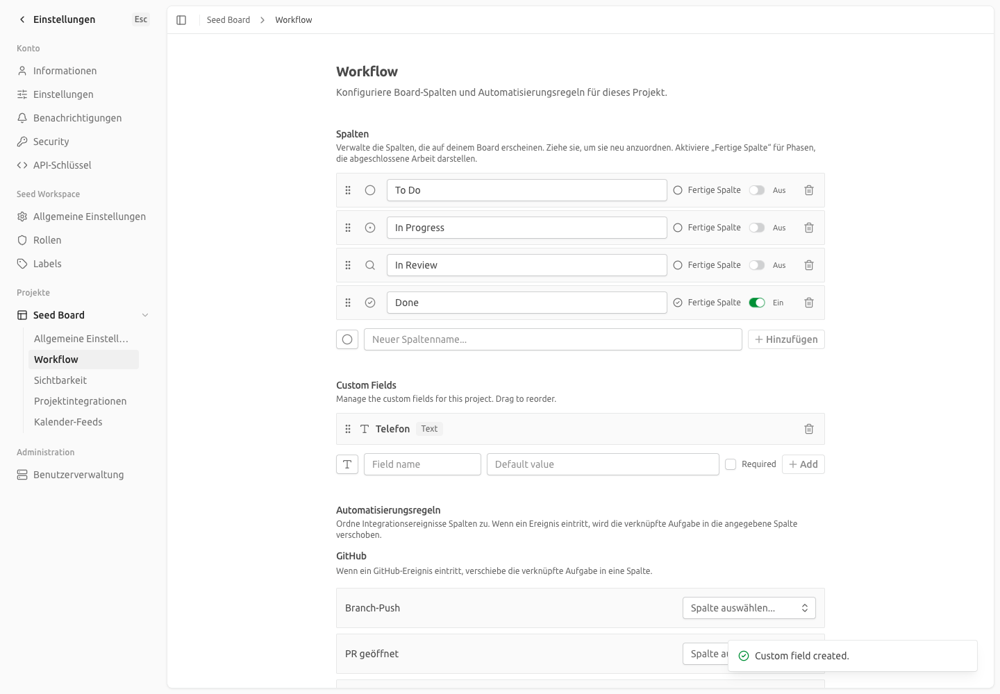
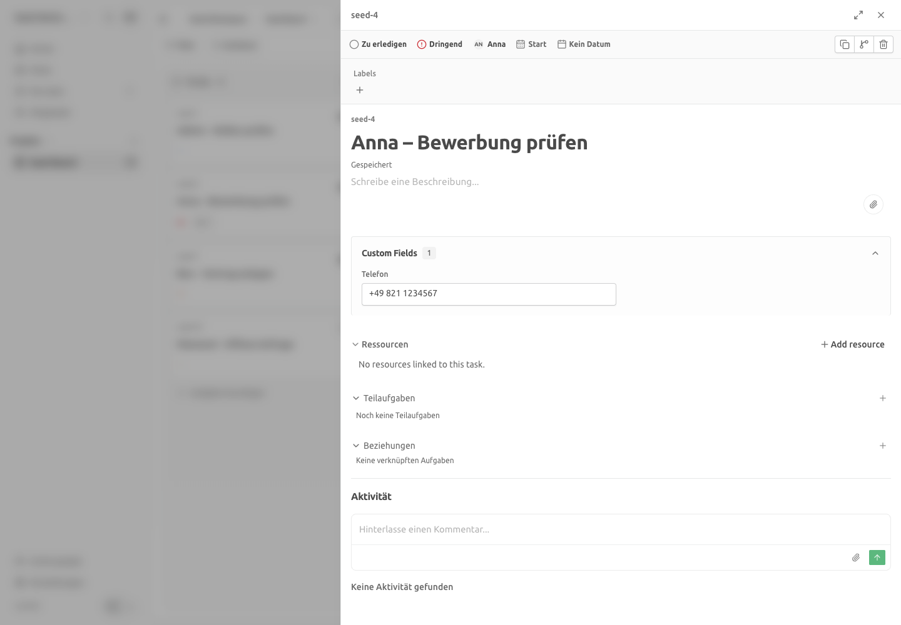
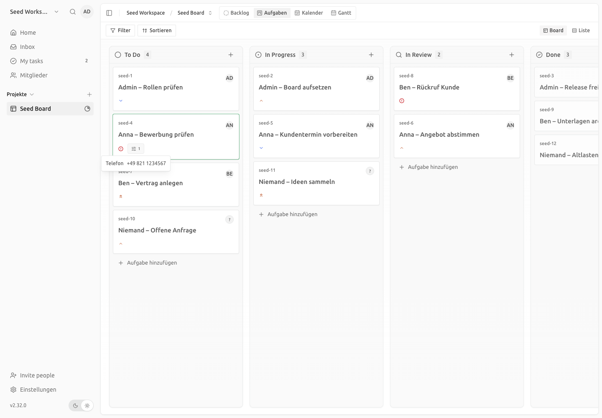

# Custom Fields — Durchstich, Datenmodell, Abgleich mit dem Konzept, Restaufwand

| | |
|---|---|
| **Story** | Als Umsetzungsteam möchte ich ein eigenes Feld vollständig durch Kaneo führen, damit die Machbarkeit des größten Fork-Eingriffs vor der Beauftragung der Stufe 1 belegt ist (Stufe 0, Baustein 3) |
| **Bezug** | Feinkonzept v3.10, Kap. 8 („Modern + MIT, aber ohne Felder“), Kap. 11 Baustein 3, Kap. 20 („Custom Fields vollständig in Stufe 1“, 4–6 PT), Kap. 21; [Zeilenfilter](2026-10-zeilenfilter-fuehrungskraft.md) (Baustein 4) |
| **Stand** | 2026-10-05, Fork `IAMDS-GMBH/pegasus-board`, `main` auf Basis Kaneo v2.32.0 (+44 Upstream-Commits) |
| **Autor** | IAMDS |

Pfadangaben beziehen sich auf die Repo-Wurzel.

---

## 0. Ergebnis auf einer Seite

**Die Prämisse der Story ist überholt: Kaneo bringt Custom Fields mit.** Upstream hat sie mit v2.24.0 am 11.09.2026 veröffentlicht (Commit `222a5bce feat: add custom fields support` vom 09.08.2026, Migration `0045`) und am 26.09.2026 um Mehrfachauswahl erweitert (`e55bdc46`, PR #1735). Das Konzept v3.10 (Recherchestand 03.09.2026) konnte das noch nicht erfassen; Kap. 8, 11, 20 und 21 gehen von einem vollständigen Eigenbau aus. Der „größte Fork-Eingriff“ ist damit keiner mehr. Baustein 3 wird überwiegend Konfiguration plus einige kleine Ergänzungen im Fork.

| Abnahmekriterium | Befund |
|---|---|
| Ein Custom Field ist in der Kartenansicht sichtbar, editierbar und wird persistiert | **Erfüllt, ohne Fork-Code.** Feld „Telefon“ (Typ Text) in den Projekteinstellungen angelegt, auf der Karte `seed-4` gesetzt, nach Neuladen vorhanden; Zeile in `custom_field_value` nachgewiesen (Abschnitt 1, Screenshots). 16 bestehende Upstream-Integrationstests laufen grün. |
| Das Datenmodell ist dokumentiert | **Erfüllt**, Abschnitt 2: zwei Tabellen, Typen, Serialisierung, Constraints, API-Routen, Hinweise für den Hub-Adapter. |
| Aufwandsschätzung Stufe 1 (4–6 PT) bestätigt oder begründet korrigiert | **Begründet korrigiert**, Abschnitt 6: Der Kern (Datenmodell, API, Feldverwaltung, Kartenansicht, Chip auf der Karte, Filter) ist vorhanden. Es bleiben Lücken gegenüber Baustein 3 im Umfang von **3–4,5 PT** (ohne CSV-Export/-Import) bzw. **4–5,5 PT** (mit). Die Konzeptspanne bleibt als Größenordnung gültig, ihr Inhalt ändert sich vollständig: nicht Bauen, sondern Ergänzen. |

**Ein echter Befund im Fork:** Die beiden projektweiten Lese-Routen für Feldwerte (`/custom-field/project/{id}/values`, genutzt vom Board-Chip, und `.../filter-values`, genutzt von der Filterleiste) kannten den Zeilenfilter aus Baustein 4 nicht. Eine Führungskraft mit Rolle „nur zugewiesene“ konnte darüber die Feldwerte **aller** Karten des Projekts lesen, also etwa Telefonnummern fremder Bewerber. Das wurde in dieser Story als Fork-Durchstich geschlossen (Abschnitt 3): 2 Controller, 2 Einzeiler im Router, 3 Integrationstests; Diff 134 Zeilen hinzu, 6 geändert.

---

## 1. Was Kaneo mitbringt (Nachweis)

Nachweis mit Playwright gegen die lokale Entwicklungsumgebung (API `:1337`, Web `:5173`, PostgreSQL 16 aus `compose.dev.yml`, Benutzer `admin@seed.test`, Oberfläche Deutsch).

**Klickpfad Feld anlegen:** Einstellungen → Projekt „Seed Board“ → Workflow → Abschnitt „Custom Fields“ → Feldname `Telefon`, Typ Text (Standard) → „Add“. Toast „Custom field created.“



**Klickpfad Wert setzen:** Board → Karte `seed-4` öffnen → Abschnitt „Custom Fields (1)“ aufklappen → `+49 821 1234567` eingeben → Verlassen des Feldes speichert (Toast „Field updated“). Nach Neuladen des Boards und erneutem Öffnen ist der Wert vorhanden.



**Board:** Die Karte zeigt einen Chip mit der Anzahl gesetzter Felder; beim Überfahren erscheinen Feldname und Wert.



**Datenbank nach dem Durchlauf:**

```
custom_field_definition: id=hjj9izylvl42i5wjw4qv1zdb  name=Telefon  type=text  required=f  position=1
custom_field_value:      task_id=xmbouocep8h5mb2tebwdkb56  field_id=hjj9izyl…  value=+49 821 1234567
```

**Was sonst vorhanden ist (geprüft am Code):**

| Bereich | Vorhanden |
|---|---|
| Feldtypen | `text`, `number`, `date`, `dropdown`, `boolean`, `multiselect` (Mehrfachauswahl, im Editor als „Dropdown · Multiple“) |
| Definition | Name, Pflicht, Standardwert, Optionen, Sortierung per Drag & Drop, Löschen; Validierung des Standardwerts je Typ (`apps/api/src/custom-field/controllers/create-custom-field.ts`) |
| Werte | Setzen/Ändern je Karte mit Typprüfung (`set-custom-field-value.ts`, `apps/api/src/task/validate-task-fields.ts`); Werte beim Anlegen einer Karte (`createTaskBody.customFields[]`) und beim Duplizieren |
| Oberfläche | Editor in der Kartenansicht (`apps/web/src/components/task/task-details-content.tsx`), Feldverwaltung in den Projekteinstellungen (`apps/web/src/components/project/custom-field-editor.tsx`), Chip + Hover auf Board-Karte (`kanban-board/task-card.tsx`) und Backlog-Zeile, Felder im „Aufgabe anlegen“-Dialog |
| Filter | Filterleiste des Boards nach Feldwerten (`board/board-toolbar.tsx`, `hooks/use-task-filters.ts`), Wertevorrat über `/filter-values` |
| Tests | `tests/api-integration/custom-field.test.ts` (15 Fälle), `custom-field-security.test.ts` (1 Fall: API-Key und eigene Rollen) |
| i18n | Schlüssel in allen 21 Locales vorhanden, in `de-DE` aber **unübersetzt** (31 von 33 Schlüsseln unter `settings.customFields` sind englisch, dazu `tasks.common.customFields`, `tasks.detail.customFieldUpdated`, `settings.projectWorkflow.customFields*`) — sichtbar in den Screenshots |

---

## 2. Datenmodell

Quelle: `apps/api/src/database/schema.ts` (Zeilen 1246–1305), Relationen in `apps/api/src/database/relations.ts`, angelegt durch Upstream-Migration `apps/api/drizzle/0045_fantastic_princess_powerful.sql`.

### 2.1 `custom_field_definition` — ein Feld je Projekt

| Spalte | Typ | Bedeutung |
|---|---|---|
| `id` | text, PK (cuid2) | technische ID; **diese ID adressiert der Hub** (es gibt keinen fachlichen `key`) |
| `project_id` | text, FK → `project.id`, `ON DELETE CASCADE` | Felder gehören zum Projekt, nicht zum Workspace |
| `name` | text, not null | Anzeigename; **nicht eindeutig** je Projekt |
| `type` | text, not null | `text` · `number` · `date` · `dropdown` · `boolean` · `multiselect` (Zod-Enum in `custom-field/schema.ts`) |
| `required` | boolean, default `false` | Pflichtfeld. Einschränkung: Ein Pflichtfeld **muss** einen Standardwert haben (400 sonst) |
| `default_value` | text, nullable | Standardwert, je Typ validiert |
| `options` | jsonb, nullable | Auswahlwerte für `dropdown`/`multiselect` als String-Array |
| `position` | integer, default 0 | Sortierung (Editor, Kartenansicht, Chip) |
| `created_at`, `updated_at` | timestamp | `updated_at` per `$onUpdate` |

Index: `custom_field_def_projectId_idx (project_id)`.

### 2.2 `custom_field_value` — ein Wert je Karte und Feld

| Spalte | Typ | Bedeutung |
|---|---|---|
| `id` | text, PK (cuid2) | |
| `task_id` | text, FK → `task.id`, `ON DELETE CASCADE` | Karte |
| `field_id` | text, FK → `custom_field_definition.id`, `ON DELETE CASCADE` | Feld; Löschen eines Feldes löscht alle Werte |
| `value` | text, nullable | **immer als Text gespeichert**, Serialisierung je Typ siehe unten |
| `created_at`, `updated_at` | timestamp | |

Indizes: `custom_field_value_taskId_idx`, `custom_field_value_fieldId_idx`; **Unique `(task_id, field_id)`** — darauf stützt sich das Upsert (`INSERT … ON CONFLICT DO UPDATE`) in `set-custom-field-value.ts`.

### 2.3 Serialisierung der Werte

| Typ | Ablage in `value` | Prüfung beim Schreiben |
|---|---|---|
| `text` | Freitext | keine |
| `number` | Dezimalzahl als String | Zahlenformat |
| `date` | ISO-Zeitstempel als String | parsbar |
| `boolean` | `"true"` / `"false"` | genau diese Werte |
| `dropdown` | ein Optionswert | muss in `options` enthalten sein |
| `multiselect` | JSON-Array als String, z. B. `["Meta","LinkedIn"]` | jedes Element in `options` |

Leerer String bzw. `null` = nicht gesetzt; Pflichtfelder lehnen leere Werte ab.

### 2.4 API (Modul `apps/api/src/custom-field/`)

| Methode · Pfad | Zugriffsauflösung | Permission | Zweck |
|---|---|---|---|
| `GET /custom-field/project/{projectId}` | `fromProject` | `project:read` | Felddefinitionen |
| `GET /custom-field/project/{projectId}/values` | `fromProject` | `task:read` | alle Werte des Projekts (Board-Chip, Backlog) — **jetzt zeilengefiltert** |
| `GET /custom-field/project/{projectId}/filter-values` | `fromProject` | `task:read` | Wertevorrat für die Filterleiste — **jetzt zeilengefiltert** |
| `GET /custom-field/task/{taskId}` | `fromTaskId` | `task:read` | Werte einer Karte (Zeilenfilter über den Task-Lookup, bereits vorher) |
| `POST /custom-field` | `fromProject` | `project:update` | Feld anlegen |
| `PUT /custom-field/reorder/{projectId}` | `fromProject` | `project:update` | Sortierung |
| `PUT /custom-field/value` | `fromTaskId` | `task:update` | Wert setzen (Upsert), ein Aufruf je Feld |
| `DELETE /custom-field/{id}` | `fromCustomField` | `project:update` | Feld löschen (kaskadiert auf Werte) |

Nicht vorhanden: **Bearbeiten einer Definition** (Name, Optionen). Upstream arbeitet daran auf dem Branch `feat/edit-custom-fields` (12 Commits, 26.–29.09.2026, 63 Dateien, +7985/−414 Zeilen).

### 2.5 Hinweise für den Hub-Adapter (Konzept Kap. 9, `felderSetzen`)

- Der Hub adressiert Felder über die **Definition-ID**. Beim Einrichten einer Kampagne (Hub-Admin, Baustein 2b) liest der Hub die Definitionen des Projekts und speichert die Zuordnung Konzept-Feld → Definition-ID in seiner Konfiguration. Ein fachlicher `key` im Fork ist dafür nicht nötig; Namen sind nicht eindeutig und dürfen sich ändern.
- `karteAnlegen` kann Werte direkt mitgeben (`POST /task`, `customFields: [{fieldId, value}]`). `felderSetzen` auf bestehende Karten ist ein `PUT /custom-field/value` **je Feld**; bei ~20 Standardfeldern sind das bis zu 20 Aufrufe je Lead. Für den Pilot tragbar; eine Batch-Route wäre eine kleine Fork-Ergänzung (Abschnitt 6, optional).
- Pflichtfelder brauchen einen Standardwert. Für Lead-Felder, die der Hub immer liefert (Quelle, Kampagne, Paket), ist `required = false` mit Hub-seitiger Prüfung praktikabler.
- Mehrfachauswahl als JSON-Array-String serialisieren; Datumsfelder als ISO-String.
- Werte-Änderungen lösen heute **kein** Realtime-Ereignis aus (Abschnitt 4). Vom Hub geschriebene Felder erscheinen bei offenen Boards erst nach dem nächsten Nachladen.

---

## 3. Umsetzung im Fork (Stufe 0): Zeilenfilter für Feldwerte

### 3.1 Befund

Baustein 4 filtert über den gemeinsamen Task-Lookup in `workspace-access-middleware.ts` und explizit in den Listen-Endpunkten. Die Custom-Field-Routen `/project/{id}/values` und `/project/{id}/filter-values` lösen den Workspace über das **Projekt** auf; dabei gibt es keine Karte, deren Zuweisung geprüft werden könnte, und die Controller filterten nur nach `project_id`. Genau diese Routen nutzt die Web-App für den Chip auf jeder Board-Karte und für den Wertevorrat der Filterleiste. Die Oberfläche blendet fremde Karten zwar aus, aber die Antwort der API enthielt deren Feldwerte vollständig.

### 3.2 Änderung

| Datei | Änderung |
|---|---|
| `apps/api/src/custom-field/controllers/get-custom-field-values-by-project.ts` | optionaler Parameter `restrictToUserId`; Bedingung `task.assignee_id = restrictToUserId` zusätzlich zu `task.project_id` (Join auf `task` war vorhanden) |
| `apps/api/src/custom-field/controllers/get-custom-field-filter-values.ts` | gleicher Parameter; `INNER JOIN task` ergänzt, Bedingung in der Distinct-Abfrage. Die Felddefinitionen bleiben ungefiltert sichtbar (Projektschema, keine Kartendaten); nur der Wertevorrat ist auf eigene Karten begrenzt |
| `apps/api/src/custom-field/index.ts` | Import `resolveAssignedOnlyUserId` aus `utils/assigned-only-scope.ts`; beide Handler reichen `await resolveAssignedOnlyUserId(c)` durch (Muster aus `activity/index.ts`) |

Gleiches Muster wie `task/controllers/export-tasks.ts` und `activity/controllers/get-workspace-activities.ts`: Ohne Restriktion ist der Parameter `null` und die Abfrage unverändert. Die Fork-Zeilen sind mit `// Pegasus fork` kommentiert. Routen-Definitionen und Antwortschemata sind unverändert; `pnpm openapi:check` bleibt grün, `apps/docs/openapi.json` ändert sich nicht.

Geprüft und **nicht** geändert: `GET /custom-field/task/{taskId}` und `PUT /custom-field/value` laufen über `fromTaskId` → `assertTasksVisible` und antworten für fremde Karten bereits mit 404 (Test unten belegt es). `POST`, `PUT /reorder`, `DELETE` sind Definitions-Änderungen mit `project:update`, die die Rolle Führungskraft nicht hat.

### 3.3 Tests

Neuer Block `describe("custom field values")` in `tests/api-integration/task-view-assigned-only.test.ts` (jetzt 20 Fälle), auf der bestehenden Fixture (Rolle `fuehrungskraft` mit `assigned_only`, Kollege `member`, Karten „Mein“ / „Fremd“ / „Pool“):

1. `/values`: Führungskraft erhält nur die Werte der eigenen Karte; der Kollege alle drei.
2. `/filter-values`: Führungskraft sieht die Definition, aber nur den eigenen Wert (`["Nord"]`); der Kollege `["Nord","Sued","West"]`.
3. Kartenebene: `GET /custom-field/task/{fremd}` und `PUT /custom-field/value` auf die fremde Karte → 404; eigene Karte → 200 mit Wert.

Gelaufen: `task-view-assigned-only` (20), `custom-field` (15), `custom-field-security` (1) → 36 grün; `tsc --noEmit` im API-Paket fehlerfrei; `pnpm lint` fehlerfrei; `pnpm openapi:check` ohne Abweichung.

---

## 4. Abgleich mit dem Konzept (Baustein 3, Kap. 20)

| Konzept-Anforderung | Upstream-Stand | Lücke | Maßnahme | Stufe | PT |
|---|---|---|---|---|---|
| Typen Text, Zahl, Datum, Auswahl, Checkbox | `text`, `number`, `date`, `dropdown`, `boolean`, zusätzlich `multiselect` | keine | — | — | 0 |
| Typ Link (`url`) | fehlt | als `text` nutzbar, ohne Validierung und ohne klickbaren Link | eigener Typ: Zod-Enum, Validierung, Editor-Icon, Anzeige als Link, 21 Locale-Schlüssel | 1 | 0,5 |
| Fachlicher Schlüssel `key` | fehlt | Hub muss IDs statt Schlüssel verwenden | Zuordnung Feld → Definition-ID in der Hub-Konfiguration (Abschnitt 2.5) | 1 (Hub) | 0 (Fork) |
| Pflicht, Optionen, Sortierung | vorhanden | Pflicht erzwingt Standardwert | Hub-seitige Prüfung; keine Fork-Änderung | — | 0 |
| `auf_karte_sichtbar` und Anzeige der wichtigsten Felder auf der Karten-Vorschau (Kampagne, Ort, Position, Paket, Score) | Chip mit Anzahl + Hover-Liste | Werte nicht direkt sichtbar; keine Auswahl, welche Felder | Spalte `visible_on_card` (Migration 0061, idempotent), Schalter im Editor, Rendering auf Board-Karte und Backlog-Zeile, Tests | 1 | 1–1,5 |
| Filter im Board nach Auswahl- und Datumsfeldern | Filterleiste vorhanden; Wertevorrat per API | Filterung **clientseitig** auf der geladenen Seite (max. 100 Karten je Request); Konzept Kap. 4 verlangt serverseitig für mehrere tausend Karten | Parameter `customFields` in `listTasksQuery`, Join in `get-tasks.ts`, Toolbar nutzt den Parameter; Index `(field_id, value)` prüfen | 1 | 1–1,5 |
| Feldverwaltung in den Projekteinstellungen | vorhanden auf der Seite „Workflow“ | — | optional eigene Seite „Felder“ (Route + Navigationseintrag) | 1 (optional) | 0,25 |
| Felddefinition bearbeiten (Name, Optionen) | fehlt; Upstream-Branch `feat/edit-custom-fields` in Arbeit | Umbenennen nur durch Löschen und Neuanlegen (Werte gehen verloren) | **abwarten und per Upstream-Sync übernehmen**, nicht bauen; Rückfall, falls bis Stufe 1 nicht gemergt: eigene Route | 1 (Sync) | 0 (Rückfall 1) |
| Deutsche Oberfläche (Kap. 4, nicht-funktional) | Schlüssel vorhanden, `de-DE` unübersetzt | englische Texte in Feldverwaltung, Kartenansicht, Toasts | 35 Schlüssel in `i18n/de-DE.json` übersetzen | 1 | 0,25 |
| Realtime bei Feldwert-Änderung (Konzept: Hub schreibt Felder, Board bleibt aktuell) | keine Ereignisse aus dem Modul | Werte erscheinen erst nach Nachladen | `publishEvent` in `set-custom-field-value.ts`, Eintrag in `ws/index.ts`, Invalidierung in `use-project-websocket.ts` | 1 | 0,5 |
| Export CSV/XLSX inkl. Custom Fields (Kap. 4), CSV-Import mit Feld-Mapping (Baustein 1) | `export-tasks.ts` und `import-tasks.ts` kennen keine Custom Fields | Konzeptaussage „CSV-Import mit Feld-Mapping — alles vorhanden“ gilt nur für Standardfelder | Export: eine Spalte je Definition; Import: Spaltenzuordnung auf Definitionen | 1 oder 2 | 1 |
| Zeilenfilter auf Feldwerten (Baustein 4 × 3) | fehlte | Datenabfluss an Führungskräfte | **in Stufe 0 geschlossen** (Abschnitt 3) | 0 | erledigt (~0,3) |
| Aktivitätstypen für Feldänderungen (Baustein 11) | nicht vorhanden | — | laut Bauentscheidung Kap. 20 Kommentare des Hub-Systemkontos statt Aktivitätstypen | — | 0 |
| Batch-Setzen mehrerer Felder je Karte (`felderSetzen`) | ein `PUT` je Feld | Mehraufwand im Hub, kein Funktionsverlust | optional `PUT /custom-field/values` (Array) | 1 (optional) | 0,5 |

---

## 5. Konfliktpotenzial beim Upstream-Abgleich

- **Heutiger Fork-Diff im Modul:** zwei Controller mit je einem optionalen Parameter und einer Bedingung, zwei Einzeiler im Router, ein Testblock. Rein additiv, mechanisch wieder anwendbar.
- **Upstream ist im selben Modul aktiv:** `feat/edit-custom-fields` ändert `custom-field/index.ts`, mehrere Controller, den Editor und `duplicate-task.ts` in großem Umfang. Beim nächsten Sync nach dessen Merge sind Konflikte in `custom-field/index.ts` wahrscheinlich, aber klein: Die Fork-Zeilen sind kommentiert, und die drei Tests schlagen fehl, sobald der Filter beim Auflösen verloren geht.
- **Neue Spalten** (etwa `visible_on_card`) bringen das Nummerierungsrisiko der Migrationen zurück, das bei `0055 → 0060` aufgetreten ist (`apps/api/src/utils/migrate-renumbered-fork-migration.ts`). Regel aus diesem Vorfall: Fork-Migrationen immer hinter der letzten Upstream-Migration nummerieren, SQL idempotent (`IF NOT EXISTS`), Kommentar „Fork migration“.
- **Realtime und serverseitiger Filter** berühren `task/get-tasks.ts`, `ws/index.ts` und `use-project-websocket.ts` — Dateien, die Upstream häufig ändert. Auch hier gilt: kleine, kommentierte Einfügungen statt Umbauten.

---

## 6. Restaufwand Stufe 1 (Baustein 3)

Konzept Kap. 20: „Custom Fields vollständig (Datenmodell, API, Feldverwaltung, Kartenansicht, Anzeige auf der Karte, Filter im Board, Tests) 4–6 PT“. Davon ist der gesamte Kern durch Upstream erledigt; realistisch hätte der Eigenbau in diesem Umfang (8 Routen, Editor mit rund 1000 Zeilen, 930 Zeilen Tests, Werte in Anlage, Duplikat, Backlog, Filter, Dialog) deutlich über der Konzeptspanne gelegen.

| Position | PT |
|---|---|
| Deutsche Übersetzung der Custom-Field-Oberfläche | 0,25 |
| Typ `url` | 0,5 |
| `visible_on_card` + Werte auf der Karten-Vorschau (Migration, API, Editor, Board, Backlog, Tests) | 1–1,5 |
| Serverseitiger Filter nach Feldwerten | 1–1,5 |
| Realtime-Ereignis für Feldwerte | 0,5 |
| **Summe Kern** | **3,25–4,25 → gerundet 3–4,5** |
| CSV-Export/-Import mit Custom Fields | 1 |
| **Summe mit Export/Import** | **4–5,5** |
| Optional: eigene Seite „Felder“ 0,25 · Batch-Route 0,5 · Rückfall „Definition bearbeiten“ 1 | bei Bedarf |

**Bewertung des Konzeptwerts:** Die Spanne 4–6 PT bleibt als Obergrenze für Baustein 3 gültig, der Inhalt ändert sich vollständig. Der Stufe-0-Anteil „Durchstich Custom Fields (Datenmodell + ein Feld)“ aus Kap. 20 hat statt des geplanten Prototyps rund 0,5 PT für Nachweis, Lückenanalyse und den Zeilenfilter-Fix gekostet.

---

## 7. Empfehlung

1. **Konzept v3.11 korrigieren:** Kap. 8 (Kaneo „ohne Felder“), Kap. 11 Baustein 3 (vom Fork-Eingriff zur Konfiguration mit Ergänzungen), Kap. 20 (Bauentscheidung und Positionen nach Abschnitt 6), Kap. 21 (Vergleich LeadTable: „Custom Fields“ ist bei beiden vorhanden). Anhang A, Zeile Kaneo: Custom Fields „ja (6 Typen)“.
2. **Baustein 3 in Stufe 1** mit den Positionen aus Abschnitt 6 beauftragen; „Definition bearbeiten“ nicht bauen, sondern den Upstream-Branch beim nächsten quartalsweisen Sync übernehmen.
3. **Zeilenfilter-Fix** aus dieser Story in den Fork übernehmen (Branch `th_PEGA-<n>`, Commit als `fix(api): apply assigned-only scope to project-level custom field reads`), damit die Testumgebung für den Pilot keine fremden Feldwerte liefert.
4. **Hub-Adapter** nach Abschnitt 2.5 entwerfen: Definition-IDs in der Kampagnen-Konfiguration, Werte beim Anlegen mitgeben, Mehrfachauswahl als JSON-Array.
5. Beim Anlegen des Standardfeldsatzes (Baustein 3, „Standardfelder Bewerber“) `required = false` verwenden und Pflichtprüfungen im Hub halten.
