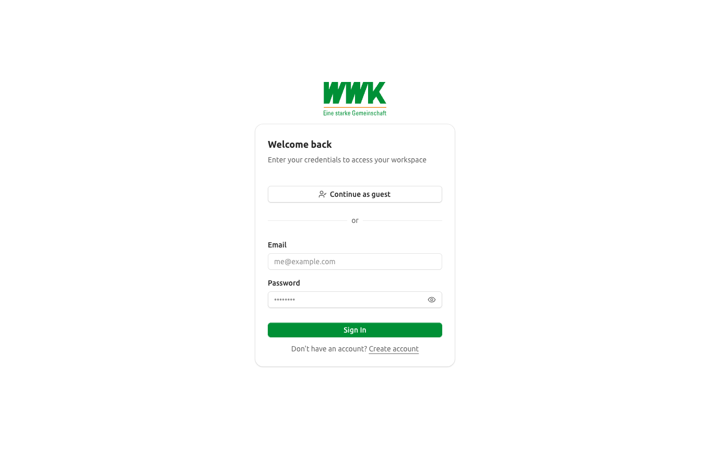
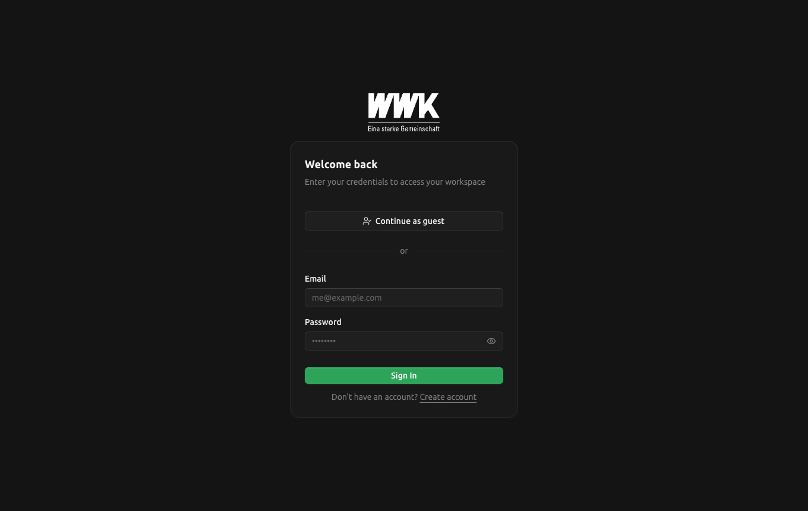
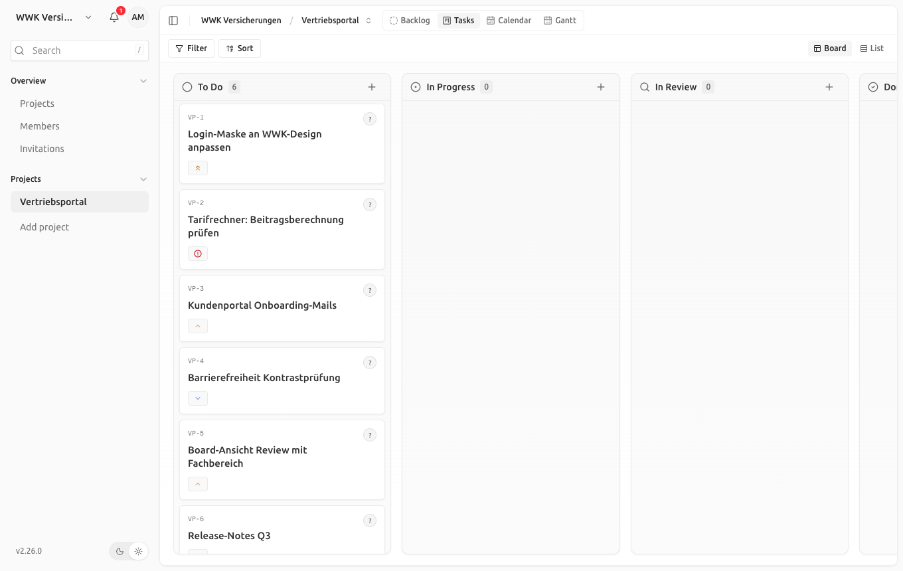
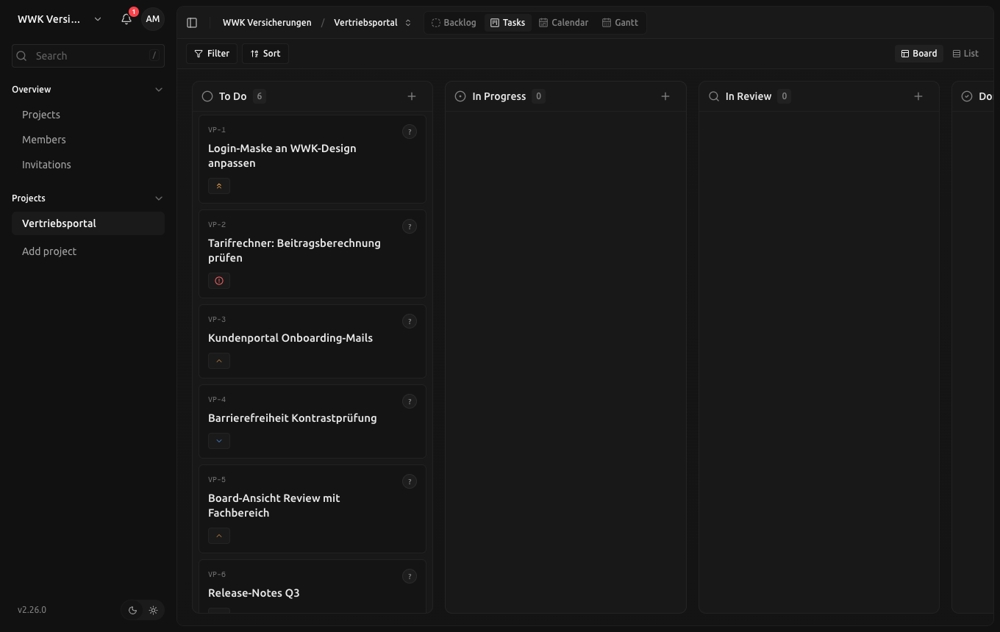
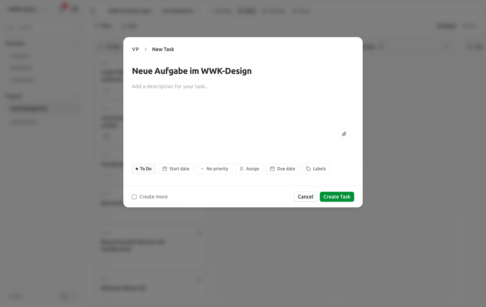

# WWK-Theme: Token-Set, Aktivierung und Grenzen

Dieses Dokument beschreibt das WWK-Erscheinungsbild der Web-App als **Theme, nicht als Redesign** (Leitlinie Kapitel 17): Es werden ausschließlich Design-Tokens (Farben, Schrift, Radius), das Logo und der Produktname ausgetauscht. Layout, Komponentenstruktur und Verhalten bleiben unverändert. Damit ist die Aussage „eigene Oberfläche im WWK-Design“ aus Kapitel 2 an Anmeldeseite und Board-Ansicht überprüfbar.

## Aktivierung

Das WWK-Theme ist der **Standard**: Ohne weitere Konfiguration (oder bei unbekanntem Wert) startet die Web-App im WWK-Design. Über die Vite-Variable `VITE_BRAND` lässt sich zur Build-/Dev-Zeit auf das unveränderte Kaneo-Basisbild umschalten, z. B. für Vergleiche.

```bash
# Standard: WWK
pnpm --filter @kaneo/web dev

# Kaneo-Basisbild zum Vergleich
VITE_BRAND=kaneo pnpm --filter @kaneo/web dev
# oder dauerhaft in apps/web/.env.local
VITE_BRAND=kaneo
```

Beim Start setzt `applyBrand()` (`apps/web/src/brand/apply.ts`) die Klasse `theme-wwk` auf `<html>`, tauscht das SVG-Favicon und setzt den initialen Dokumenttitel. Die Klasse liegt neben `light`/`dark`, daher funktionieren Hell- und Dunkelmodus unverändert.

## Token-Set

Quelle der Markenwerte sind die gelieferten Logodateien (`wwk-logo-4c.svg`, `wwk-logo-rgb.svg`, `wwk-logo-1c.svg`, `wwk-logo-negativ.svg`) und die Ubuntu-Schriftfamilie (Ubuntu Font Licence 1.0).

### Markenwerte

| Token | Wert | Herkunft |
|---|---|---|
| `--brand-green` | `#009036` | Wortmarke „WWK“ und Claim |
| `--brand-orange` | `#ee7d00` | Trennlinie unter der Wortmarke |
| Schwarz / Weiß | `#000` / `#fff` | 1c- und Negativ-Variante |
| Schrift | Ubuntu 300/400/500/700 (+ 400 kursiv) | `@fontsource/ubuntu` (npm, woff2) |
| Produktname | „WWK Board“ | Abstimmung im Projekt |

### Zuordnung auf die semantischen Tokens (`apps/web/src/index.css`, Blöcke `.theme-wwk` und `.theme-wwk.dark`)

| Semantisches Token | Hell | Dunkel | Wirkung |
|---|---|---|---|
| `--font-sans` (und damit `--font-heading`) | Ubuntu | Ubuntu | gesamte UI-Typografie |
| `--radius` | `0.375rem` (Kaneo: `0.625rem`) | gleich | Eckenradius von Buttons, Karten, Eingaben |
| `--primary` / `--primary-foreground` | Grün / Weiß | aufgehelltes Grün (`color-mix` 82 % Grün + Weiß) / Weiß | Primär-Buttons, aktive Zustände |
| `--ring`, `--sidebar-ring` | Grün | aufgehelltes Grün | Fokusringe |
| `--sidebar-primary` / `-foreground` | Grün / Weiß | aufgehelltes Grün / Weiß | aktive Sidebar-Einträge |
| `--success` / `-foreground` | Grün / dunkles Grün | aufgehelltes Grün / helles Grün | Erfolgsmeldungen, erledigte Zustände |
| `--warning` / `-foreground` | Orange / dunkles Orange | Orange / helles Orange | Warnungen, Priorität „medium/high“ |
| `--chart-1` … `--chart-5` | Grün, Orange, Dunkelgrün, Neutral, Hellgrün | analog aufgehellt | Diagramme |

Bewusst **nicht** überschrieben: `--info` (Blau) und `--destructive` (Rot) behalten ihre semantische Bedeutung; Hintergründe, Text- und Rahmenfarben bleiben neutral, damit Kontrast und Lesbarkeit der Basis erhalten bleiben.

### Logo und Produktname (`apps/web/src/brand/index.ts`)

| Feld | Kaneo | WWK |
|---|---|---|
| `name` | Kaneo | WWK Board |
| `logo.onLight` | `/logo-dark.svg` | `/brands/wwk/logo.svg` (4c) |
| `logo.onDark` | `/logo-light.svg` | `/brands/wwk/logo-negative.svg` (weiß) |
| `logo.heightClassName` | `h-6` | `h-16` |
| `favicon` | `/favicon.svg` | `/brands/wwk/favicon.svg` (Wortmarke weiß auf Grün) |

Der Produktname fließt in den Browser-Tab (`PageTitle`), in den Alt-Text des Logos und über die i18n-Variable `{{appName}}` in Texte. Umgestellt sind exemplarisch `auth.signUp.instanceAdminTitle` und `onboarding.pageTitle` in `i18n/en-US.json`.

## Exemplarisch umgesetzte Ansichten

- **Anmeldeseite** (`/auth/sign-in`): WWK-Logo, Ubuntu, grüner Primär-Button, grüne Fokusringe, Tab-Titel „Sign In · WWK Board“.
- **Board-Ansicht** (Kanban): Ubuntu, grüne Primäraktionen (z. B. „Create Task“ im Aufgaben-Dialog), grüne Fokusringe, orangefarbene Prioritätsmarker, reduzierter Eckenradius. Spalten, Karten, Toolbar und Sidebar sind strukturell unverändert. Die Board-Fläche selbst ist bewusst neutral gehalten (weiße/graue Karten, keine Primärfarbe im Ruhezustand), daher zeigt sich die Marke dort vor allem über Schrift, Radius und Aktionen.

Beide Ansichten funktionieren im Hell- und Dunkelmodus. Screenshots aus dem lokalen Dev-Lauf:

| Ansicht | Hell | Dunkel |
|---|---|---|
| Anmeldeseite |  |  |
| Board |  |  |
| Board, Aufgabe anlegen |  | – |

## Grenzen des Themings

Was ohne Eingriff in Layout, Komponentencode oder Build-Prozess **nicht** erreichbar ist:

1. **Logo-Proportionen.** Das WWK-Logo ist ein gestapeltes Zeichen mit Claim (300×159), die Kaneo-Wortmarke ist breit (450×104). Auf der Anmeldeseite braucht das WWK-Logo `h-16` statt `h-6`, wodurch die Karte etwas nach unten rückt. In der Sidebar gibt es keinen Platz für ein Produktlogo (dort sitzt der Workspace-Umschalter mit dem Workspace-Logo). Ein WWK-Logo in der Sidebar wäre eine Layout-Änderung.
2. **Statische Build-Artefakte.** `index.html` (`<title>`, Meta-Tags, OpenGraph/Twitter-Vorschau), `site.webmanifest` (PWA-Name, `theme_color`), `apple-touch-icon.png`, PNG-Favicons und `favicon.ico` sind statisch. Tab-Titel und SVG-Favicon werden zur Laufzeit getauscht; Link-Vorschauen in Messengern und der Name einer installierten PWA zeigen weiterhin „Kaneo“, solange der Build-Schritt nicht angepasst wird.
3. **Produktname in Texten.** Rund 23 Texte in `i18n/en-US.json` (Integrationen, Webhooks, Einladungs-Mails, Einstellungen) nennen „Kaneo“ ausgeschrieben. Die anderen Sprachen wurden nicht angefasst. E-Mails und andere Texte, die die API erzeugt (Einladungen, Webhook-Signatur-Header `X-Kaneo-Signature`), sind nicht Teil des Web-Themes.
4. **Semantische Farben.** Info (Blau) und Fehler/Löschen (Rot) liegen außerhalb der WWK-Palette und bleiben bewusst erhalten. Orange ist auf „Warnung“ gelegt; dadurch erscheinen Prioritäten „medium/high“ orange.
5. **Kontrast.** Weißer Text auf `#009036` erreicht ca. 4,2:1. Das genügt für UI-Komponenten und große Schrift (WCAG 3:1), liegt aber unter AA für Fließtext (4,5:1). Der Markenwert wurde nicht verändert; im Dunkelmodus wird ein aufgehelltes Grün verwendet.
6. **Typografie und Form jenseits der Tokens.** Schriftgrößen-Skala, Gewichte, Abstände, die Sidebar-Variante („inset“), Kartenaufbau und Pillen-Badges sind Komponentencode, keine Tokens. Ubuntu läuft breiter als Geist; einige Labels werden früher abgeschnitten (`truncate`).
7. **Upstream-Hinweise.** „Powered by Kaneo“ auf öffentlichen Projektseiten, Links auf kaneo.app und die Versionsanzeige bleiben bestehen.
8. **Nutzerdaten.** Workspace-Logos, Label-Farben und Avatare sind Daten der Nutzer und werden vom Theme nicht beeinflusst.
9. **Nur Build-Zeit.** Der Wechsel zwischen WWK und Kaneo-Basisbild erfordert einen neuen Web-Build bzw. ein neues Web-Image. Ein Laufzeit-Platzhalter (wie `KANEO_API_URL` in `apps/web/env.sh`) wurde bewusst nicht ergänzt.

## Beteiligte Dateien

- `apps/web/src/brand/index.ts`, `apply.ts`, `index.test.ts` – Brand-Definition und Bootstrap
- `apps/web/src/index.css` – Ubuntu-Import und Token-Blöcke `.theme-wwk` / `.theme-wwk.dark`
- `apps/web/src/components/common/logo.tsx`, `page-title.tsx`, `src/lib/i18n/index.ts`, `src/main.tsx`
- `apps/web/public/brands/wwk/` – `logo.svg`, `logo-negative.svg`, `favicon.svg`
- `i18n/en-US.json` – zwei Texte mit `{{appName}}`
- `ENVIRONMENT_SETUP.md` – `VITE_BRAND`
